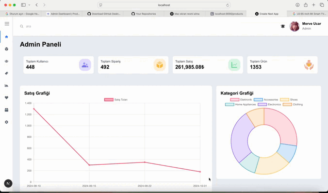

# Admin Dashboard Project
In this project, I effectively used Next.js App Router structure and TypeScript's type safety. I designed a modern and responsive interface with TailwindCSS and integrated data visualization features with Chart.js.

# 🔧 Technologies Used:

- Next.js 15.3.1 (App Router)
  
- React 19

- TypeScript
  
- TailwindCSS 4
  
- Chart.js and React-Chartjs-2 (data visualization)
  
- JSON Server (mock API)
  
- React Icons
  
- React Toastify (notification system)

# ✨ Key Features:

- Modern and responsive design
  
- Real-time data visualization
  
- User-friendly interface
  
- Fast and high-performance structure
  
- Type safety with TypeScript
  
- Mock API integration

# Preview of the Project

